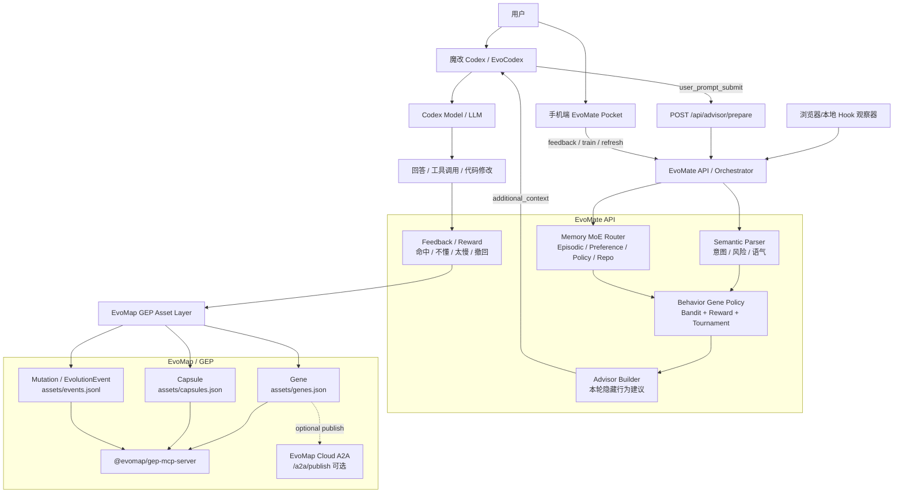
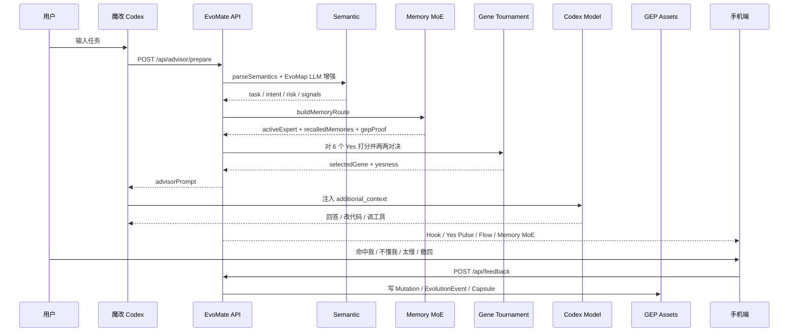
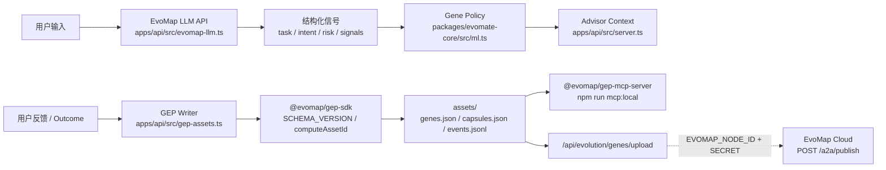
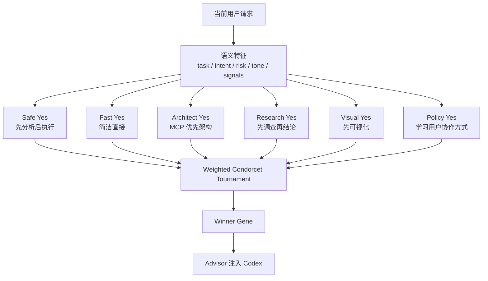
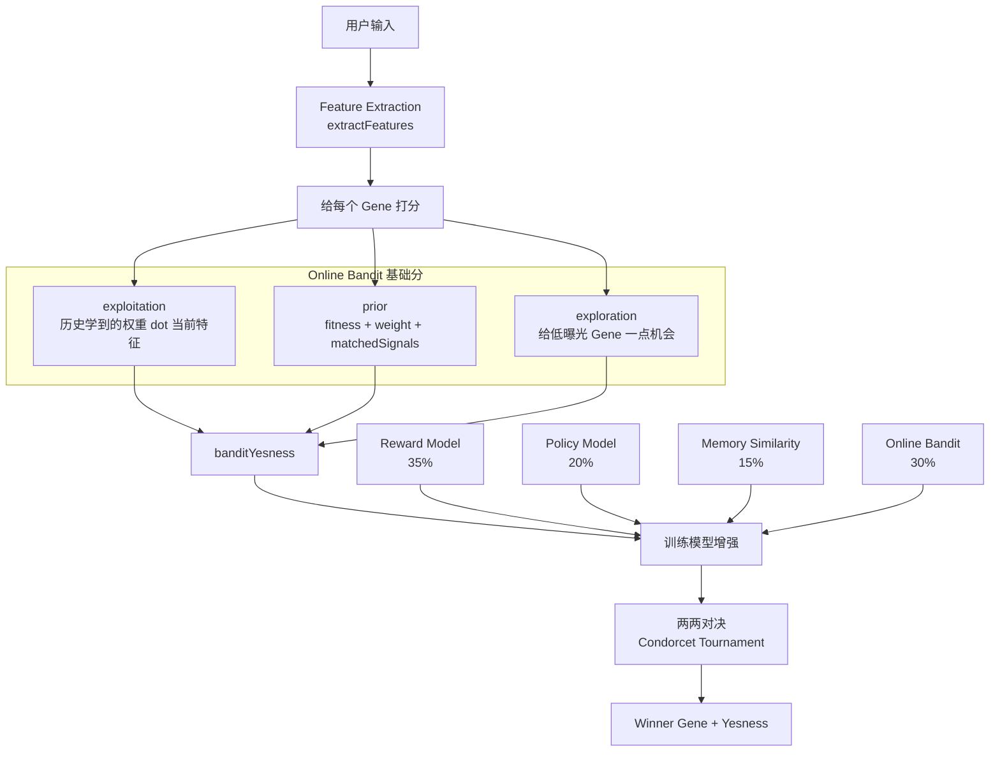
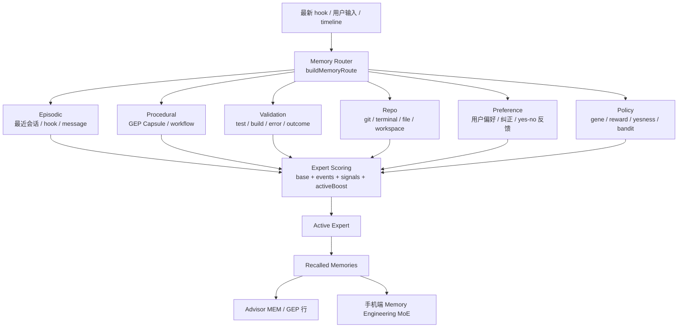
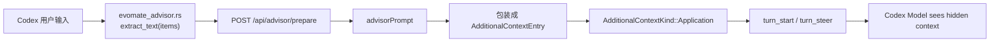
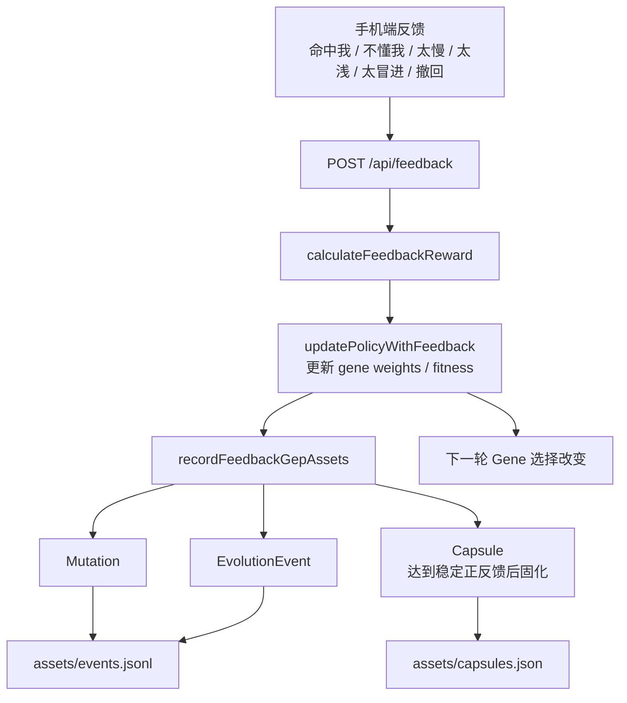
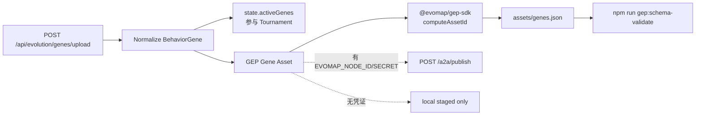

# EvoMate — EvoMap 自进化超级助理

> **一句话：EvoMate 是 Codex / Claude Code / Cursor 的自进化 sidecar，让现有 AI Agent 在真实使用中学习用户偏好、选择行为基因、写入 EvoMap GEP 资产，并在下一轮变得更懂你。**

EvoMate 不做另一个聊天框。它的定位是 **Agent Evolution Layer**：

```text
不是：用户 → 新聊天机器人 → 回答
而是：用户 → Codex/Claude/Cursor → EvoMate Sidecar → 行为进化
```

核心闭环：

```text
Hook → Semantic → Memory MoE → Gene Tournament → Advisor → Codex → Feedback → GEP → Train
```

---

## 1. 总览架构



---

## 2. 一轮请求怎么跑



---

## 3. EvoMap 技术栈在哪里



EvoMap 在项目里的角色：

| 层 | 技术 | 代码位置 | 作用 |
|---|---|---|---|
| 语义增强 | EvoMap LLM API | `apps/api/src/evomap-llm.ts` | 结构化解析用户输入 |
| GEP 资产 | `@evomap/gep-sdk` | `apps/api/src/gep-assets.ts` / `scripts/gep_bridge.mjs` | 生成 asset_id、schema 校验 |
| MCP 记忆 | `@evomap/gep-mcp-server` | `package.json` 的 `mcp:local` | 把 Gene/Capsule/Event 暴露给 Agent |
| 云端共享 | A2A `/a2a/publish` | `POST /api/evolution/genes/upload` | 可选发布 Gene 到 EvoMap Hub |

---

## 4. 6 个 Yes / Behavior Gene



基础 6 个 Yes 定义在：

```text
packages/evomate-core/src/index.ts
```

前端展示镜像在：

```text
apps/web/components/EvolutionConsole.tsx
```

---

## 5. 机器学习在哪里起效

机器学习不是直接生成答案，而是决定：**这次应该用哪个行为基因驱动 Codex。**



核心公式：

```text
score = exploitation + prior + exploration
yesness = sigmoid(score)

finalYesness =
  0.30 * online_bandit
+ 0.35 * reward_model
+ 0.20 * policy_model
+ 0.15 * memory_similarity
```

代码位置：

```text
packages/evomate-core/src/ml.ts
apps/api/src/trained-models.ts
memory/evomate/models/reward_model/preference_model.json
memory/evomate/models/policy_model/policy_model.json
memory/evomate/models/embedding_index/embedding_index.json
```

---

## 6. Memory MoE 是什么

Memory MoE 把记忆拆成 6 个专家，每轮根据用户输入和最新事件选择最相关的专家。



后端代码：

```text
apps/api/src/server.ts → buildMemoryRoute()
```

前端展示：

```text
apps/web/components/EvolutionConsole.tsx → MemoryMoEPanel
```

---

## 7. Advisor 是怎么注入 Codex 的



重点：

```text
不是网页注入，不是用户可见 prompt。
是魔改 Codex 内部 additional_context 注入。
```

Codex fork 代码位置：

```text
/Users/wangyue/codexcahnge/codex/codex-rs/tui/src/evomate_advisor.rs
```

Advisor 生成代码：

```text
apps/api/src/server.ts → prepareAdvisor() / buildAdvisorPrompt()
```

---

## 8. 反馈如何变成进化



反馈 reward 类型：

```text
accepted      +0.85
corrected     -0.45
interrupted   -0.75
rejected      -0.95
undo          -0.90
manual_score  (score - 0.5) * 2
```

---

## 9. Gene 上传 / EvoMap Cloud 预留



接口已经可用：

```text
POST /api/evolution/genes/upload
```

---

## 10. 公网演示

稳定入口：

```text
https://evomate.yueanlab.com/mobile
https://evomate.yueanlab.com/graph
https://evomate.yueanlab.com/api/hook-events
```

本地入口：

```text
http://127.0.0.1:3333/mobile
http://127.0.0.1:3333/graph
```

---

## 11. 快速启动

安装依赖：

```bash
npm install
```

启动 API：

```bash
set -a; [ -f ./.env.local ] && . ./.env.local; set +a
EVOMATE_API_PORT=8787 npm run evomate:api
```

另开终端启动前端：

```bash
EVOMATE_WEB_PORT=3333 NEXT_PUBLIC_EVOMATE_API_URL=http://127.0.0.1:8787 npm run evomate:web
```

打开：

```text
http://127.0.0.1:3333/mobile
```

---

## 12. 验证闭环

核心 smoke：

```bash
npm run evomate:smoke
```

看到：

```text
EVOMATE_SMOKE_OK
```

代表：

```text
hook event
  → advisor prepare
  → Memory MoE route
  → advisorPrompt 注入 MEM/GEP
  → feedback 写 GEP Mutation/EvolutionEvent
  → memory route 读回 GEP proof
```

GEP schema 校验：

```bash
npm run gep:schema-validate
```

API typecheck：

```bash
npm run check -w apps/api
```

---

## 13. 常用命令

```bash
npm run evomate:api
npm run evomate:web
npm run evomate:smoke
npm run evomate:status -- --json
npm run evomate:history -- jobs
npm run evomate:train -- preference_train
npm run mcp:local
npm run evomate:check
```

可选 smoke 场景：

```bash
npm run evomate:smoke -- --scenario preference
npm run evomate:smoke -- --scenario validation --no-write
npm run evomate:smoke -- --scenario procedural --no-write
npm run evomate:smoke -- --scenario repo --no-write
```

默认 smoke 使用 fast advisor，避免现场被外部 LLM 网络延迟卡住。要验证真实 EvoMap LLM：

```bash
npm run evomate:smoke -- --llm
```

---

## 14. 关键目录

```text
apps/api/                         # EvoMate API: hooks, advisor, feedback, Memory MoE, GEP writes
apps/web/                         # Next.js mobile dashboard + graph
apps/browser-extension/           # ChatGPT / Claude / Gemini / Doubao web hook observer
apps/local-agent/                 # 本地 Git / Terminal / 桌面活动 hook
packages/evomate-sidecar/         # Codex / Claude Code hook CLI
packages/evomate-hooks/           # 统一 hook protocol
packages/evomate-core/            # behavior genes, policy/reward, semantic parser
packages/evomate-mcp/             # EvoMate MCP server
assets/                           # GEP genes/capsules/events store
memory/evomate/                   # runtime state, models, remote jobs
vendor/codex/                     # vendored Codex pointer；真实改造在 /Users/wangyue/codexcahnge/codex
```

---

## 15. 路演讲法

```text
今天的 AI Agent 很聪明，但不会真正成长。
你每天纠正它，它下一次还是可能犯同样的错。

EvoMate 做的是 Agent 的自进化层：
它观察用户在 Codex 里的真实工作流，
用 EvoMap LLM 做语义解析，
用 Memory MoE 召回偏好和 GEP 资产，
用 Behavior Gene Tournament 选择本轮协作方式，
再通过 Codex additional_context 注入本轮 advisor。

用户反馈会变成 reward，写入 Mutation / EvolutionEvent / Capsule，
下一轮 Gene 选择和 advisor 就会改变。

最终，Agent 学到的不只是提示词，而是可验证、可迁移、可上传到 EvoMap 的行为基因。
```

---

## 16. 安全边界

- `.env.local` 被 gitignore，真实 EvoMap key 不提交。
- `memory/`、`assets/events.jsonl` 默认忽略，避免提交本地会话和反馈流水。
- Browser extension 现在主线是观察/反馈，网页 advisor injection 是 fallback，不是主产品路径。
- 主注入路径是魔改 Codex 的 `additional_context`。
