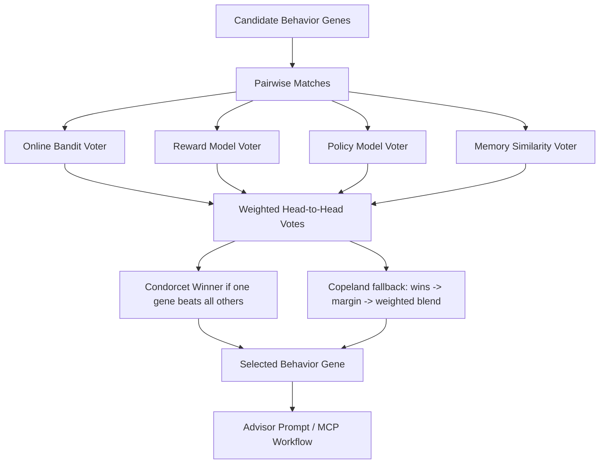

# EvoMate Architecture

## High-Level System

```text
EvoMate Web
  -> EvoMate API / Orchestrator
    -> EvoMate Core State Machine
    -> EvoMate MCP Server
    -> EvoMap GEP MCP Server
    -> Codex Runner / external workers
```


## Semantic-First Evolution Router

The main architecture is semantic-first:

```text
User Input / Feedback
  -> Semantic Parser
    -> Behavior Policy Evolution Layer
    -> Instruction Evolution Layer
    -> Workflow / Tool Evolution Layer
    -> Gene Tournament Selector
  -> Evolution Composer
  -> EvoMap GEP Assets
```

This avoids sending raw user text independently into ML, prompt mutation, and workflow routing. The Semantic Parser produces one shared meaning contract, then the three evolution layers act on it. Full spec: `docs/EVOMATE_SEMANTIC_ARCHITECTURE.md`.

## Architecture Diagrams

Roadshow-ready Mermaid diagrams are recorded in `docs/EVOMATE_ARCHITECTURE_DIAGRAMS.md`.

## Runtime Loop

```text
1. User sends request
2. Backend extracts signals
3. Online bandit / reward model / policy model / memory lane score candidate genes
4. Gene Tournament runs pairwise Behavior Gene elections
5. Winning Behavior Gene generates Advisor Prompt / MCP route
6. Agent answers or dispatches execution worker
7. User feedback is captured
8. Backend records outcome into EvoMap memory
9. Successful behavior is solidified into Capsule
10. Future similar requests recall the Capsule/Gene
```

## Gene Tournament Selector

EvoMate does not simply pick the highest raw score. The final behavior is elected through a weighted Condorcet tournament:



This gives the roadshow a clear concept:

```text
EvoMate holds an election before every agent turn. The output is not just an answer;
it is the behavior mode the agent should become for this user right now.
```

## Behavior Gene Examples

```json
{
  "id": "gene_ask_before_execution",
  "category": "repair",
  "signals_match": ["ambiguous_execution_permission", "coding_task", "user_interruption"],
  "summary": "When user intent is ambiguous, analyze first and ask before editing files.",
  "strategy": [
    "Restate the task in one sentence",
    "Classify risk and required permission",
    "Provide a short plan",
    "Wait for explicit execution confirmation before file edits"
  ],
  "validation": ["node scripts/validate-behavior-gene.mjs"]
}
```

## Frontend Product Objects

- Memory Core: durable user-specific memory and behavior state.
- Behavior Genome: active behavior genes and weights.
- Evolution Timeline: user feedback -> mutation -> outcome -> capsule chain.
- Fitness Panel: predicted satisfaction, acceptance rate, interruption rate, confirmation rate.
- MCP Trace: tools called by the orchestrator.

## Why Own State Machine

The model can reason, but it should not own durable behavioral evolution. EvoMate backend owns:

- state transitions
- feedback interpretation
- gene selection
- outcome recording
- safety/confirmation gates
- product analytics


## GEP Asset Write Path

```text
POST /api/feedback
  -> previewFeedbackReward()
  -> applyFeedback()
  -> recordFeedbackGepAssets()
    -> Mutation asset
    -> EvolutionEvent asset
    -> optional Capsule after repeated success
  -> assets/events.jsonl / assets/capsules.json
  -> npm run gep:schema-validate
```

The API does not hand-write `asset_id`; it uses `@evomap/gep-sdk` `computeAssetId()` so generated assets pass hash verification.
